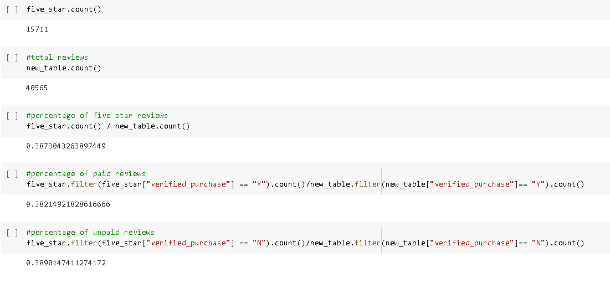

# Amazon_Vine_Analysis

## I. Overview of Project

### Background
As a data expert at Big Market, we have to help our client, Sellby, to compare reviews of their products compared to the reviews of similar products sold by their competitors and select reviewers to give free products. All the reviews need to be translated in order to analyze them.

### Objective
Since your work with Jennifer on the SellBy project was so successful, you’ve been tasked with another, larger project: analyzing Amazon reviews written by members of the paid Amazon Vine program. You’ll have access to approximately 50 datasets and you’ll need to pick one. We will use PySpark, AWS RDS, Pandas, and SQL to determine if there is any bias toward favorable reviews from Vine members in the dataset. 

## II. Results

The data set chosen was ***Video_Games***.

Since bias would easily be seen if there are undeserved 5-Star reviews coming from the paid reviews from Vine, the percentage of 5 star reviews have been presented above.

- The total percentage of 5-Star reviews is at 38.73%. 
- The 5-star percentage of the paid reviews(38.21%) is actually lower than the average.
- The 5-star percentage of the unpaid reviews(38.90%) is actually higher than the average.

## III. Summary
